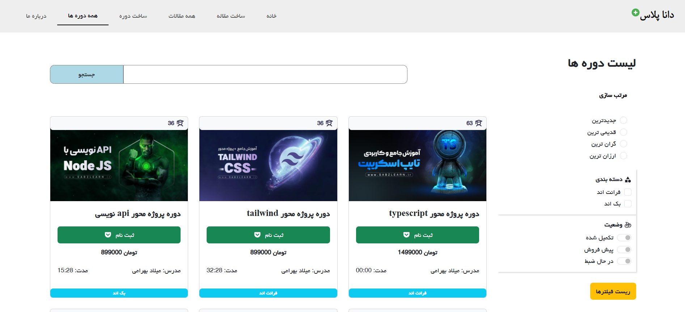

# پروژه دانا پلاس (Dana Plus)

یک پلتفرم آموزشی فارسی شامل مقالات و دوره‌های آموزشی با رابط کاربری ریسپانسیو و امکانات مدیریت محتوا.

---

### دمو آنلاین

[مشاهده دمو](https://your-demo-url.com)

### نمای کلی پروژه

| صفحه اصلی |  |
| لیست مقالات |  |
|لیست دوره ها |  |
| جزئیات مقاله |  |

---

## ویژگی‌ها

- قابلیت **افزودن، مشاهده، ویرایش** مقاله‌ها
- قابلیت **افزودن، مشاهده** دوره‌ها
- استفاده از **React Router DOM** برای مسیرهای چندگانه
- طراحی مدرن و واکنش‌گرا با **React-Bootstrap**
- اتصال به API برای داده‌ها با **Axios**
- نمایش اعلان‌ها با **SweetAlert2**
- نمایش جدیدترین **مقالات** و **دوره‌ها** با اسلایدر Swiper
- بارگذاری داده‌ها از **MockAPI** سرویس رایگان

---

## استفاده از MockAPI

پروژه برای ذخیره‌سازی و دریافت داده‌ها از سرویس رایگان [MockAPI.io](https://mockapi.io) استفاده می‌کند.

### آدرس دیتابیس‌ها:

| نوع دیتا | Endpoint API                                                |
| -------- | ----------------------------------------------------------- |
| مقالات   | `https://68690518d5933161d70d2e6b.mockapi.io/data/articles` |
| دوره‌ها  | `https://68690518d5933161d70d2e6b.mockapi.io/data/courses`  |

---

| مسیر               | توضیح              |
| ------------------ | ------------------ |
| `/`                | صفحه اصلی          |
| `/articles`        | نمایش لیست مقالات  |
| `/article/:id`     | نمایش جزئیات مقاله |
| `/addarticle`      | فرم افزودن مقاله   |
| `/editarticle/:id` | فرم ویرایش مقاله   |
| `/courses`         | نمایش لیست دوره‌ها |
| `/courses/:id`     | نمایش جزئیات دوره  |
| `/addcourse`       | فرم افزودن دوره    |
| `/about`           | درباره ما          |

---

### تکنولوژی ها و ابزارها:

-React 18+

-React Router DOM

-Axios

-React Bootstrap

-Swiper

-SweetAlert2

-React Icons

-MockAPI (برای شبیه‌سازی داده‌ها)

## نصب و اجرا

```bash
git clone https://github.com/your-repo/danaa-plus.git
cd danaa-plus
npm install
npm run dev
```
